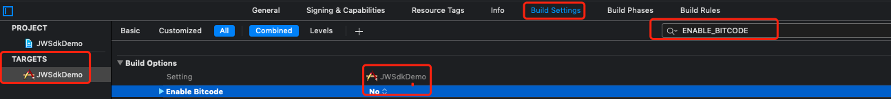

### 一、导包设置流程

1. 导入对应的库


2. 设置Target

3. 关闭项目ENABLE_BITCODE

   

4. 由于ios高版本限制需要添加info描述

   ```objective-c
   NSBluetoothAlwaysUsageDescription
   ```

5. 导入fmdb

### 二、简单使用流程

1. 设置Uid

   ```objective-c
   /**
    初始化
    
    @param uid 标志id （
    使用场景： 1、A账号连接了，B账号再连接会连接失败，需要A账号解绑
    2、A账号在A手机上连接，使用B手机登录A账号，也可以连接
    ）
    */
   [JWBleManager.shareInstance setUpWithUid:@"programmer"];
   ```

2. 监听回调

   ```objective-c
   /**
       连接和一些基本的回调
       请注意：判断是否真正连接成功，要以JWBleDeviceConnectStatus_SyncSuccess为准
        */
       JWBleManager.shareInstance.connectStateChangeCallBack = ^(JWBleDeviceConnectStatus deviceConnectStatus) {
           if (deviceConnectStatus == JWBleDeviceConnectStatus_Connect) {
               NSLog(@"JWBleDeviceConnectStatus_Connect");
           } else if (deviceConnectStatus == JWBleDeviceConnectStatus_SyncSuccess) {
               if (JWBleManager.shareInstance.connectionModel == nil) {
                   return;
               }
               NSLog(@"JWBleDeviceConnectStatus_SyncSuccess");
           } else if (deviceConnectStatus == JWBleDeviceConnectStatus_SyncFailure) {
   
               NSLog(@"JWBleDeviceConnectStatus_SyncFailure");
           } else if (deviceConnectStatus == JWBleDeviceConnectStatus_DiscoverNewUpdateFirm) {
   
               NSLog(@"JWBleDeviceConnectStatus_DiscoverNewUpdateFirm");
           } else if (deviceConnectStatus == JWBleDeviceConnectStatus_DisConnect) {
               NSLog(@"JWBleDeviceConnectStatus_DisConnect");
   
           } else if (deviceConnectStatus == JWBleDeviceConnectStatus_BondFailure) {
               NSLog(@"JWBleDeviceConnectStatus_BondFailure");
   
           } else if (deviceConnectStatus == JWBleDeviceConnectStatus_BatteryUpdate) {
               NSLog(@"JWBleDeviceConnectStatus_BatteryUpdate");
   
           } else if (deviceConnectStatus == JWBleDeviceConnectStatus_ChargeStatusChanged) {
               NSLog(@"JWBleDeviceConnectStatus_ChargeStatusChanged");
           }
   
       };
   ```

   